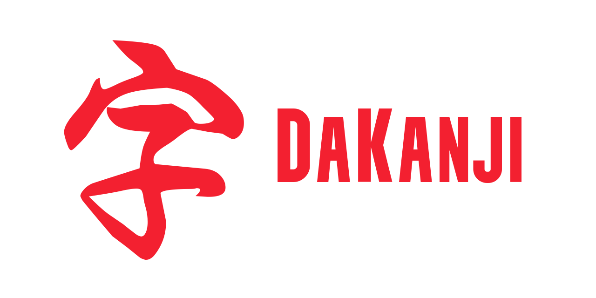
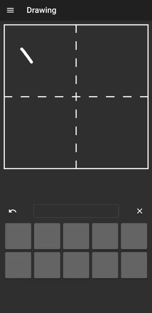

# DaKanji

<table>
  <tr>
    
   <tr/>
  <tr>
    
  <tr/>
  <tr>
  <tr/>
<table/>

## What is this

DaKanji helps students of the Japanese language and people who use it.
Currently it can recognize 6500+ characters (Kanji, Hiragana, Katakana, Romaji, Arabic Numbers) which the user draws by hand.
But the feature set will be vastly improved in the coming releases.  
For more details about the features take a look at the [usage section](#usage).
  

 

## What the users say

* "Your program is like magic! Thank you so much!" - saszai2
* "Well thank you for this software! It seems to try and guess in a more "guess-y" way than jisho and even Google which is usually pretty good at guessing, and it just saved me today!" - princess_daphie
* "Amazing. I can write kanji messier than a professor and it still picks it up. Very reliable." - Seth Kitchens

## Getting started

**Currently only android is supported**  
The easiest way is to download the app for android from the PlayStore.
You can also download the latest release from the [releases page](https://github.com/CaptainDario/DaKanji-Mobile/releases) or [setup a development environment](https://github.com/CaptainDario/DaKanji-Mobile/wiki/Setting-up-a-development-environment) and build the app on your own.

## Usage

In this section the features of the app are explained in more detail.

### Handwritten kanji recognition

The user can draw a character in the UI and the app will predict which character was drawn. This prediction can than be opened in a dictionary of choice. A dictionary can be chosen in the settings.
Those dictionaries include translation apps, app dictionaries and web dictionaries. 
Currently 6500+ characters are supported. 
All supported characters can be found [here](https://github.com/CaptainDario/DaKanji-Mobile/blob/main/assets/labels_CNN_kanji_only.txt). 

### Contributing

All contributions are welcome!  
Here is a list of a few things which would help this project:
* Testing (beta) releases please join the [discord server](https://discord.gg/cYTcpFStbs) and ask in the "become a tester"-channel. All testing is much appreciated!
* DaKanji does not support your (native) language yet? Head over to the [wiki](https://github.com/CaptainDario/DaKanji-Mobile/wiki/Internationalization-and-localization) and learn how to add it to DaKanji
* If you have ideas how to improve this app [open an issue](https://github.com/CaptainDario/DaKanji-Mobile/issues).
* You found a bug? Please [open an issue](https://github.com/CaptainDario/DaKanji-Mobile/issues) too.
* PR's for open issues are very welcome too

## Credits

* Design
  * icon / banner
    * Thanks "Buddha, with kudos to 2ch/fl/ and HatNyan" for helping design the icon and the banner.
    * Thanks [Adrian Jordanov](https://www.1001fonts.com/theater-font.html) for the font.
  * UI
    * Massive shout out to [Ellina](https://github.com/nurellina)! Without your help the app would not look and feel half as good as it does now
* Modified Packages: [bitmap](https://github.com/renancaraujo/bitmap), [snappable](https://github.com/MarcinusX/snappable)
* A big shout out to all testers!
  * Android
    * pa9eup, tsumugii_12
