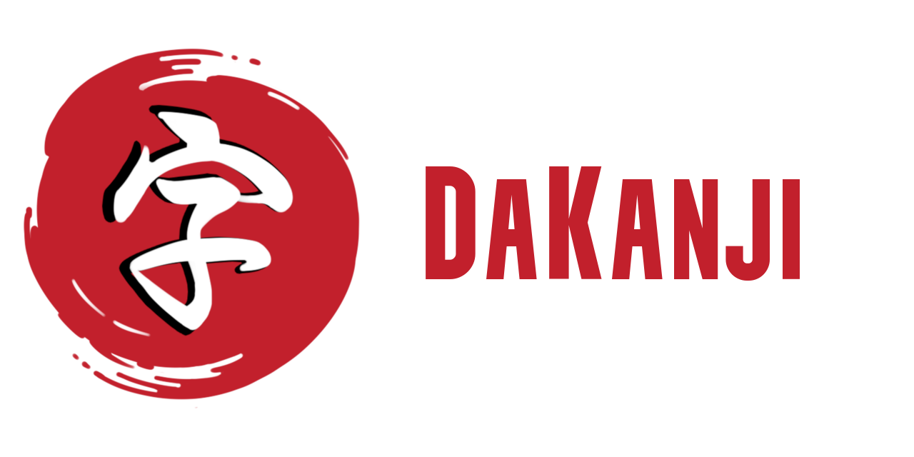

<table>
  <tr>
    
   <tr/>
  <tr>
    
  <tr/>
  <tr>
    
  <tr/>
  <tr>
    
  <tr/>
  <tr>
    
  <tr/>
<table/>

## What is this

You are learning Japanese? Then you need to try DaKanji!  
Use the built-in dictionary to look up words in many languages, search Kanjis by simply drawing them, add furigana to texts, and much more!

Feature overview:

* Recognize 6500+ Kanji and all Kana offline by just drawing them
* Use the inbuilt dictionary to look up words offline
  * Multi-language support: en, es, de, fr, ...
  * Detailed information about words: pitch accent, related words, ...
  * Detailed information about Kanji: radicals, JLPT, ...
  * Example sentences
  * Drawing or radical-based kanji lookup
  * 6000+ audios
* Read any text with ease by adding furigana, spaces, and more to texts
* Use it on all your devices: Android, Windows, Mac, iOS, or Linux it doesn't matter!

 

## What the users say

* "Your program is like magic! Thank you so much!" - saszai2
* "Well thank you for this software! It seems to try and guess in a more "guess-y" way than jisho and even Google which is usually pretty good at guessing, and it just saved me today!" - princess_daphie
* "Amazing. I can write kanji messier than a professor and it still picks it up. Very reliable." - Seth Kitchens

## Contributing

All contributions are welcome!
Here is a list of things that would help this project:

* Testing! You cannot believe how much this helps out, DaKanji became quite a big project and many things go unnoticed. For testing (beta) releases please join the [discord server](https://discord.gg/cYTcpFStbs) and ask in the "become a tester"-channel (or take a look at the release section there could be a pre-release available). All testing is much appreciated!
* If you have ideas how to improve this app or you found a bug please [open an issue](https://github.com/CaptainDario/DaKanji-Mobile/issues).
* Of course you can become involved in this project, head over to discord and ask what a great feature to work on would be or take a look at [issues labeled as 'good first issue'](https://github.com/CaptainDario/DaKanji/issues?q=is%3Aopen+is%3Aissue+label%3A%22good+first+issue%22).
* Or if you like this project, giving it a star or rating it on the store of your platform would also help immensely

## Credits

I want to thank all the people involved in this project, without you the project would not be where it's right now!

But a special thanks goes to michalpatryk.

Please take the time and read the full [credits.](CREDITS.md)
